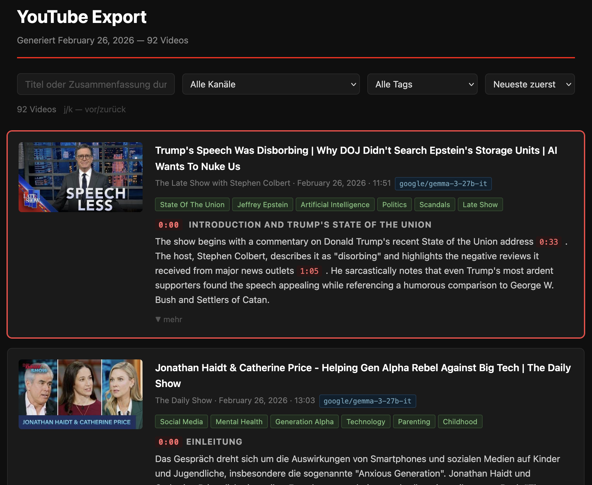

# youtube-abo-summarizer

Fetches new videos from your YouTube subscriptions (or an explicit channel list), retrieves their transcripts, summarizes them with an LLM, and renders a self-contained HTML report — optionally delivered by email. Supports [OpenRouter](https://openrouter.ai) (default) and local [Ollama](https://ollama.com) instances (or any OpenAI-compatible endpoint).



## Features

- **Two-phase pipeline**: Separate collection (fetch + summarize) from reporting (render + send), so transcripts and LLM calls only happen when new videos arrive — not on every digest
- **Two source modes**: OAuth-based subscription list or explicit channel IDs/handles
- **Incremental runs**: Tracks the last-checked timestamp per channel in `last_run.json`; only fetches videos published since the last run
- **Transcript fetching**: Configurable language priority (`TRANSCRIPT_LANGS`, default: `de,en`); falls back to any available language
- **AI summarization**: Generates structured HTML summaries written as flowing prose (bullet points only for genuine enumerations); sections are in chronological order and scaled to video length (2–3 sections for short videos, up to 6–10 for long ones); each section contains clickable timestamp links placed inline after the relevant sentence; output language configurable via `SUMMARY_LANG` (default: German). The same LLM call also extracts 3–7 concise English topic tags, stored alongside the summary
- **Transcript and summary storage**: Transcripts and summaries are cached to `data/`. On subsequent runs, videos that already have both a transcript and a summary are skipped entirely — no redundant YouTube or LLM calls. If only the transcript is missing it is fetched; if only the summary is missing the stored transcript is re-used and only the LLM call is made
- **Dark-theme HTML report**: Self-contained, mobile-responsive, with per-channel sections and video cards
- **Browsable archive export**: Single portable HTML file with client-side search, channel filter, tag filter, sort, and pagination — works fully offline; tag chips on cards are clickable and toggle the tag filter
- **Repair tool**: Re-fetches missing transcripts and re-summarizes missing or broken summaries; supports targeting specific videos
- **Email delivery**: Sends the report via SMTP
- **Cron-ready**: Includes shell scripts for frequent collection and daily/6-hour/12-hour digest delivery

## Requirements

- Python 3.8+
- A [Google Cloud project](https://console.cloud.google.com/) with the YouTube Data API v3 enabled and OAuth 2.0 credentials
- An LLM backend: [OpenRouter](https://openrouter.ai) API key (default) **or** a local [Ollama](https://ollama.com) instance
- An SMTP server for email delivery (optional)

## Setup

```bash
git clone https://github.com/AlainBla/youtube-abo-summarizer.git
cd youtube-abo-summarizer

python3 -m venv .venv
source .venv/bin/activate
pip install -r requirements.txt

cp .env.example .env
# Edit .env and fill in your credentials
```

Place your Google OAuth credentials in `client_secrets.json` (downloaded from the Google Cloud Console).

### `.env` variables

**LLM backend** — `LLM_*` variables take precedence over `OPENROUTER_*` when both are set.

| Variable | Required | Description |
|---|---|---|
| `OPENROUTER_API_KEY` | OpenRouter only | Your OpenRouter API key |
| `OPENROUTER_MODEL` | No | Model ID for OpenRouter (default: `gpt-oss-20b`) |
| `LLM_BASE_URL` | Ollama / custom | API base URL, e.g. `http://localhost:11434/v1` |
| `LLM_MODEL` | No | Overrides `OPENROUTER_MODEL` when set |
| `LLM_API_KEY` | No | Overrides `OPENROUTER_API_KEY` when set; omit for Ollama |
| `SMTP_HOST` | For email | SMTP server hostname |
| `SMTP_PORT` | For email | `465` (SSL) or `587` (STARTTLS) |
| `SMTP_USER` | For email | SMTP username |
| `SMTP_PASS` | For email | SMTP password |
| `SMTP_FROM` | No | Sender address (defaults to `SMTP_USER`) |
| `SUMMARY_LANG` | No | Language for LLM-generated summaries (default: `German`); any name the model understands, e.g. `English` |
| `TRANSCRIPT_LANGS` | No | Comma-separated transcript language priority list (default: `de,en`); falls back to any available language |
| `WEBSHARE_PROXY_URL` | No | Residential proxy URL for transcript fetching |
| `PROXY_FALLBACK_COUNTRY` | No | Country code used for the geo-block retry (default: `DE`); appended to the Webshare username, e.g. `US`, `GB` |

## Usage — two-phase pipeline (recommended)

The pipeline is split into a **collect** phase and a **report** phase. Run collection frequently so new videos are picked up quickly; run report on whatever digest schedule you want. Transcript fetching and LLM summarization only happen during collection.

### 1. Collect — fetch new videos, transcripts, and summaries

```bash
# Use your YouTube OAuth subscriptions
python collect.py --auth

# Look back N hours instead of using persisted state
python collect.py --auth --hours 2

# Explicit channels (IDs, handles, or URLs)
python collect.py UC123abc @SomeHandle

# Read channels from a file (one per line)
python collect.py --file channels.txt
```

Results are written to `data/` (SQLite metadata + individual transcript and summary files). Videos already in the store are handled incrementally: if both transcript and summary exist they are skipped entirely; if only one is missing, only the missing piece is fetched or generated. Old entries are pruned after 7 days by default (`--prune-days N` to change).

### 2. Report — render and optionally send a digest

```bash
# Render a 24-hour digest (default)
python report.py --output summary.html

# Custom time window
python report.py --hours 6 --output summary_6h.html

# Skip channels with no new videos and send via email
python report.py --hours 24 --skip-empty --send-to you@example.com

# Show the LLM model badge on each card
python report.py --show-model
```

No YouTube API calls or LLM calls happen here — it reads only from `data/`.

## Usage — export archive

`export.py` renders all (or a subset of) stored videos into a single self-contained HTML file for offline browsing. It includes client-side search across titles and summaries, a channel filter dropdown, a tag filter dropdown, sorting by date/channel/title, and pagination (20 items per page). Tag chips on each video card are clickable and set the tag filter directly. No server required.

```bash
# Last 7 days (default)
python export.py

# All videos in the store
python export.py --all

# Custom time window
python export.py --hours 48

# Custom output filename
python export.py --all --output full_archive.html

# Show the LLM model badge on each card
python export.py --show-model
```

`--hours` and `--all` are mutually exclusive. The default output filename is `export_YYYY-MM-DD_HH-MM.html`.
The LLM model badge is hidden by default; use `--show-model` to display it.

## Usage — repair

`repair.py` scans the store and fixes missing or broken transcripts and summaries. The most common use case is re-summarizing specific videos after finding bad model output.

```bash
# Re-summarize two specific videos
python repair.py --force-summarize --video abc123xyz def456uvw

# Preview what would be repaired without making any changes
python repair.py --dry-run

# Repair all missing transcripts and summaries
python repair.py

# Re-summarize everything (e.g. after switching to a better model)
python repair.py --force-summarize
```

| Flag | Description |
|---|---|
| `--video ID [ID ...]` | Restrict to specific video IDs |
| `--force-summarize` | Re-summarize even if a summary already exists; also re-generates tags |
| `--dry-run` | Print what would be done without writing anything |

`country_blocked` videos are never re-fetched (permanent restriction).

To backfill tags on videos summarized before tag support was added, run `python repair.py --force-summarize`.

## Usage — all-in-one mode (for ad-hoc runs)

`summarize.py` fetches, summarizes, and renders in a single pass without using the store. Useful for one-off runs or testing.

```bash
python summarize.py --auth
python summarize.py --auth --hours 12
python summarize.py UC123abc @SomeHandle
python summarize.py --file channels.txt --output report.html --skip-empty
```

## Email delivery (standalone)

```bash
python3 send_mail.py "YouTube Summary 2026-02-23" recipient@example.com summary_2026-02-23.html
```

## Scheduled runs (cron)

Recommended crontab setup:

```
# Collect every 30 minutes
*/30 * * * *  /path/to/collect.sh >> /path/to/cron.log 2>&1

# Send a 6-hour digest
0 */6 * * *   /path/to/run_6hours.sh >> /path/to/cron.log 2>&1

# Send a daily digest at 07:00
0 7   * * *   /path/to/run_daily.sh  >> /path/to/cron.log 2>&1
```

| Script | Purpose |
|---|---|
| `collect.sh` | Runs `collect.py --auth`; schedule this frequently |
| `run_6hours.sh` | Renders and emails a 6-hour digest via `report.py` |
| `run_12hours.sh` | Renders and emails a 12-hour digest via `report.py` |
| `run_daily.sh` | Renders and emails a 24-hour digest via `report.py` |

Each report script activates the virtual environment, renders the HTML, sends the email, and cleans up HTML files older than 7 days.

## Architecture

| File | Role |
|---|---|
| `collect.py` | Collect-phase CLI: resolves channels, fetches videos/transcripts/summaries, writes to `data/` |
| `report.py` | Report-phase CLI: reads `data/`, renders HTML, optional SMTP send |
| `export.py` | Export CLI: renders a self-contained HTML archive with client-side search, channel filter, tag filter, sort, and pagination |
| `repair.py` | Repair CLI: re-fetches missing transcripts and re-summarizes missing/broken summaries (also re-generates tags with `--force-summarize`) |
| `store.py` | SQLite + file store: `data/videos.db` (metadata + tags as JSON array), `data/transcripts/<id>.txt`, `data/summaries/<id>.html` |
| `summarize.py` | All-in-one CLI: fetch + render in a single pass (no store involvement) |
| `youtube_client.py` | YouTube Data API v3 wrapper (OAuth, subscriptions, video search, channel resolution) |
| `transcripts.py` | `youtube-transcript-api` wrapper; language selection, timestamp formatting, error handling |
| `openrouter.py` | LLM client (OpenRouter by default, or any OpenAI-compatible endpoint); returns `(summary_html, tags)` tuple — structured HTML with chronological sections, proportional depth, and timestamp links, plus 3–7 English topic tags extracted from a `<!-- tags: ... -->` comment appended by the model |
| `renderer.py` | Jinja2 renderer; writes the final HTML report |
| `template.html.j2` | Self-contained dark-theme HTML template |
| `state.py` | Reads/writes `last_run.json` (per-channel ISO timestamps) |
| `send_mail.py` | SMTP email sender |

## Limitations

### YouTube API quota
The YouTube Data API has a daily quota of **10,000 units**. Fetching videos from many channels in a single run can exhaust this quickly. The tool stops gracefully when the quota is exceeded, but remaining channels are skipped for that run.

### Transcript availability
- Transcript languages are requested in the order defined by `TRANSCRIPT_LANGS` (default: `de,en`). Videos without a matching transcript fall back to any available language; if no transcript exists at all a "no transcript" notice is shown.
- **Live streams**, **Shorts**, and some copyright-claimed videos may have no transcript.
- **Region-locked videos** are detected via `VideoUnplayable`. Only videos whose unplayable reason explicitly mentions "country" or "region" are treated as geo-blocked. When `WEBSHARE_PROXY_URL` is set, the tool automatically retries such videos once using a country-pinned proxy (default: `DE`, configurable via `PROXY_FALLBACK_COUNTRY`). The video is only marked `country_blocked` (permanent skip) if the retry also fails; other `VideoUnplayable` causes — including future live events — are marked `unavailable` and retried on the next run.

### IP blocking
YouTube actively blocks transcript requests from **datacenter IP addresses**. If the tool runs on a server or VPS, most transcript fetches will be blocked. Symptoms: the HTML report shows "IP blocked" notices for the majority of videos.

**Mitigation**: Set `WEBSHARE_PROXY_URL` in `.env` to route transcript requests through a residential proxy. The tool includes full support for [Webshare](https://webshare.io) proxies via `youtube-transcript-api`'s `GenericProxyConfig`. Geo-blocked videos are automatically retried via a country-pinned Webshare proxy (see `PROXY_FALLBACK_COUNTRY` above).

### LLM cost and availability
When using OpenRouter, summarization costs money per token and depends on API availability. As an alternative, point the tool at a local [Ollama](https://ollama.com) instance (free, offline) by setting `LLM_BASE_URL=http://localhost:11434/v1` and `LLM_MODEL=<model>` in `.env`.

## Sensitive files (never commit)

| File/Dir | Contents |
|---|---|
| `client_secrets.json` | Google OAuth app credentials |
| `token.pickle` | Cached OAuth token |
| `.env` | API keys and SMTP credentials |
| `last_run.json` | Per-channel run state |
| `data/` | SQLite database, transcripts, and summaries |

All of the above are listed in `.gitignore`.

## License

MIT
